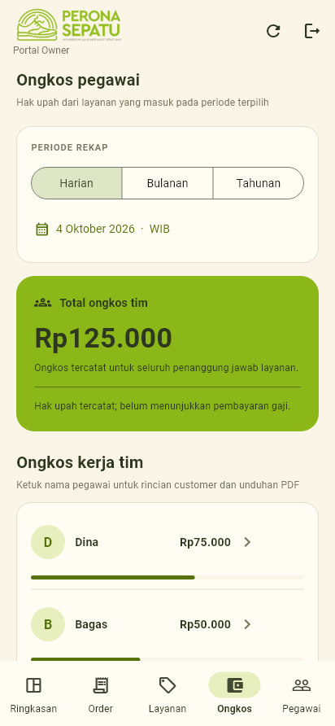
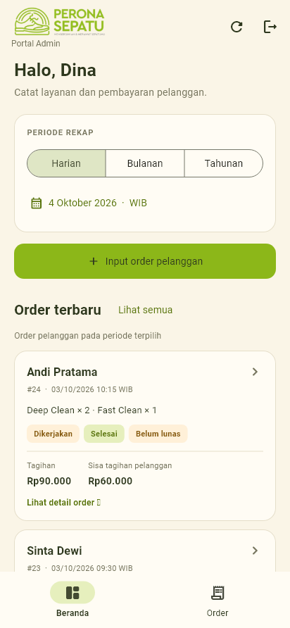
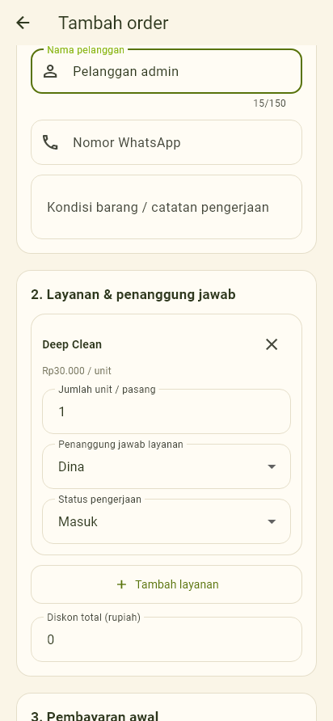

# Akses owner, admin, dan teknisi

Versi `0.1.3+4`, 4 Oktober 2026. Nota tersedia bagi ketiga peran, selalu tanpa
ongkos. PDF rekap admin juga tanpa ongkos/gaji; rincian ongkos pegawai dan PDF
upah khusus owner/teknisi. Form order tidak menampilkan ongkos untuk semua
peran. Lihat [PDF.md](PDF.md) untuk cara unduh dan bagikan.

| Kemampuan | Owner | Admin | Teknisi |
|---|---|---|---|
| Input/edit order, pembayaran, foto | Ya | Ya | Ya |
| Membaca detail pelanggan dan tagihan | Ya | Ya | Ya |
| Rekap usaha | Ya | Tidak | Ya |
| Halaman Ongkos dan upah seluruh tim | Ya | Tidak | Ya |
| Membaca tarif ongkos layanan | Ya | Tidak | Ya |
| Mengubah tarif layanan | Ya | Tidak | Tidak |
| Mengaktifkan akun/mengubah peran | Ya | Tidak | Tidak |
| Menghapus order/koreksi pembayaran | Ya | Tidak | Tidak |
| Membaca audit melalui database/API | Ya | Tidak | Tidak |

Ongkos pegawai ditampilkan di tab **Ongkos**, terpisah dari Ringkasan.
Owner dan teknisi melihat ongkos tim dan rincian per pegawai. Teknisi juga
melihat jumlah ongkos pribadinya. Ini hak upah yang tercatat pada tanggal order
masuk, belum buku pembayaran gaji. Admin memiliki Beranda dan Order saja.
Form, pemilih layanan, dan detail admin hanya menampilkan harga pelanggan.
Penanggung jawab layanan dipilih dari teknisi atau owner; admin bukan penerima
ongkos teknisi. Role `staff` lama tetap aktif dan ditampilkan sebagai Teknisi.

## Menerapkan pada proyek Supabase yang sudah berjalan

1. Buka **SQL Editor → New query** pada proyek Perona di dashboard Supabase.
2. Salin seluruh isi `supabase/003_roles_and_wage_privacy.sql` dan klik **Run**.
   File ini berisi satu transaksi dan dapat dijalankan ulang. Jangan jalankan
   ulang `001_schema.sql` atau menghapus database. Transaksi lama dipertahankan.
3. Pasang APK terbaru `build/app/outputs/flutter-apk/app-release.apk` di atas
   aplikasi sebelumnya. Versinya `0.1.2+3`; gunakan kunci signing yang sama.
4. Login owner, buka **Pegawai → menu Atur akses** pada akun yang dipilih,
   lalu pilih **Aktifkan sebagai admin** atau **Aktifkan sebagai teknisi**.
   Pengguna yang diubah perannya keluar lalu login kembali.

Pasang APK baru sebelum pengguna login dengan peran admin/technician yang baru:
APK lama belum mengenali dua nama peran tersebut. Akun staff lama tidak diubah
otomatis oleh migrasi, sehingga tetap bisa dipakai sambil memperbarui aplikasi.
Untuk instalasi Supabase baru, jalankan `001`, `002`, kemudian `003`.

## Pembatasan di server

RLS menolak admin membaca tabel `services` dan `orders` mentah karena memuat
tarif/snapshot ongkos. Admin membaca RPC `service_catalog`, `order_list`, dan
`order_detail` yang membuang `labor_fee` serta `labor_total`. RPC rekap upah
menolak admin; audit yang menyimpan snapshot ongkos tetap hanya untuk owner.
Jumlah order per tanggal tersedia lewat RPC tanpa angka ongkos. Pembatasan
memakai role tersimpan di profiles, bukan metadata signup atau pilihan di HP.

Perhitungan ongkos, tarif historis, retry pembayaran, dan izin upload foto tetap
berjalan di server. Upload admin memakai cek keberadaan order berupa boolean
karena admin tidak mendapat akses baca tabel order mentah. Helper payload yang
bisa membaca snapshot ongkos tidak diberi izin EXECUTE kepada klien.

## Verifikasi dan status

- 45 tes Flutter lulus: peran/navigation, halaman Ongkos, admin tanpa permintaan
  rekap, form dan detail tanpa angka ongkos, input QRIS dengan layanan tanpa
  tarif upah, filter/paginasi tanggal, serta alur pembayaran/foto sebelumnya.
- 55 pemeriksaan PostgreSQL lokal lulus memakai PGlite dengan stub Auth/Storage:
  RLS/RPC, redaksi ongkos di JSON, pembatasan role, input/pelunasan/upload admin,
  upah teknisi tetap dihitung, dan migrasi dijalankan ulang tanpa menghapus data.
- `flutter analyze lib test` tanpa temuan; build APK release `0.1.2+3` berhasil.
- Migrasi **belum dijalankan pada Supabase online**: browser Codex tidak login
  ke dashboard. Jalankan langkah SQL di atas sebelum memberi role baru.
- Uji end-to-end online memakai tiga akun/perangkat nyata belum dilakukan.
  APK saat ini masih memakai signing debug proyek untuk pengujian.

