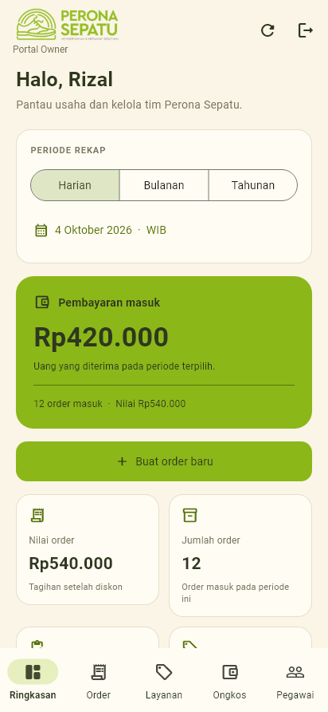
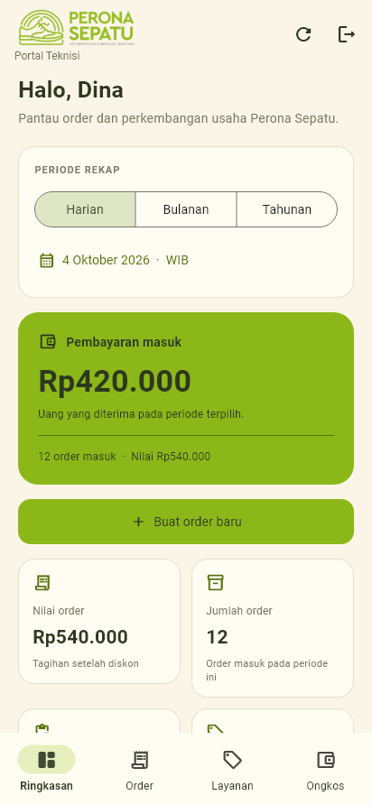
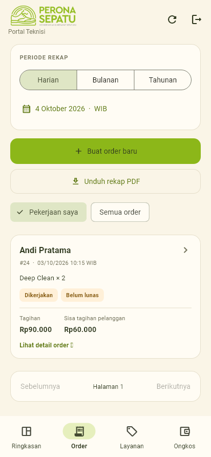
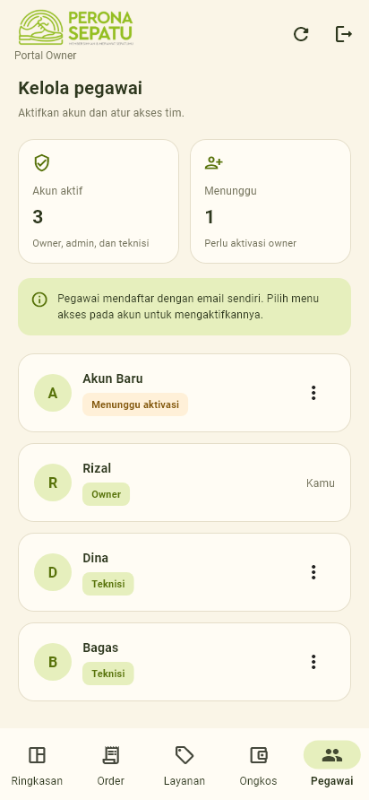
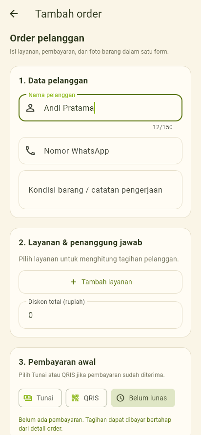
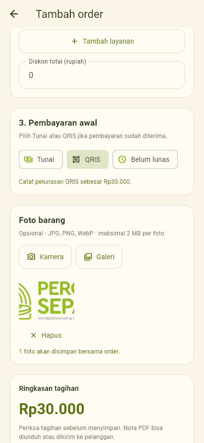
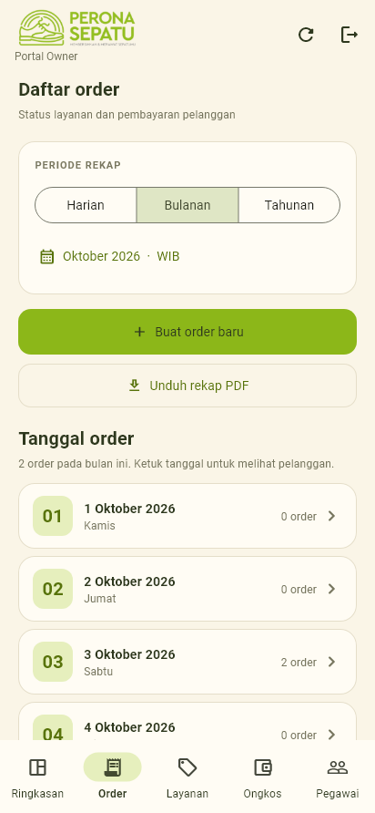
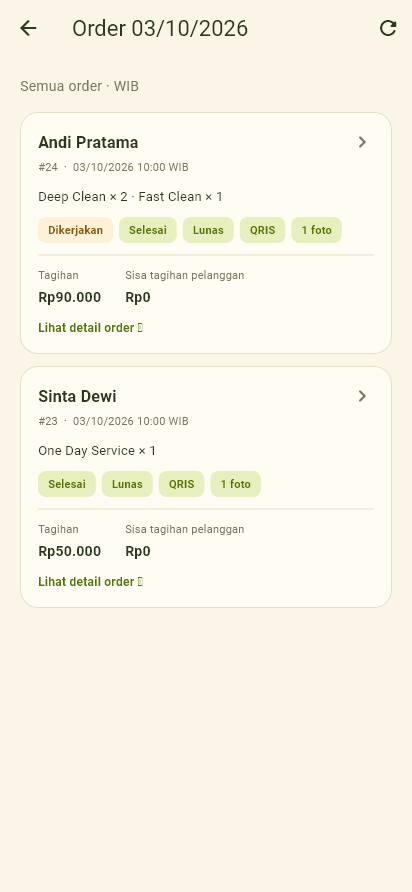

# Tampilan owner dan pegawai

**Versi terbaru 0.1.3+4:** Form order tidak menampilkan ongkos untuk semua peran.
Ada pilihan menyimpan saja atau membuat nota PDF pelanggan. Halaman Ongkos
memiliki rincian pekerjaan pegawai yang dapat dibuka dan diunduh, sedangkan
halaman Order menyediakan unduhan rekap periode lengkap.
Cara penggunaan dan batas perhitungan ada di [PDF.md](PDF.md).

**Versi 0.1.2+3:** Ongkos memiliki halaman tersendiri.
Ada peran Owner, Admin, dan Teknisi; admin tidak mendapat menu/data ongkos.
Hak akses dan langkah SQL untuk mengaktifkannya dijelaskan di
[AKSES.md](AKSES.md). Bagian 3 Oktober di bawah adalah riwayat tampilan sebelumnya.

Perubahan 3 Oktober 2026. Peran berasal dari `profiles.role` setelah login;
pengguna tidak memilih peran sendiri pada halaman masuk.

## Owner

- Ringkasan: pembayaran masuk, nilai order, ongkos tim, piutang seluruh periode,
  diskon, ongkos per pegawai, dan order terbaru.
- Order: input, detail, pembayaran, foto, dan tindakan koreksi khusus owner.
- Layanan: pencarian, penambahan, perubahan tarif, dan penonaktifan layanan.
- Pegawai: akun aktif dan pending, aktivasi, perubahan peran, dan penonaktifan.

## Pegawai

- Beranda: ongkos pribadi untuk seluruh periode yang dipilih dan order yang
  memiliki layanan dengan `worker_id` milik akun tersebut.
- Order: beralih antara pekerjaan sendiri dan seluruh order untuk operasional.
- Layanan: pencarian dan pembacaan harga/ongkos layanan aktif.
- Menu pengelolaan pegawai dan perubahan tarif tidak tersedia pada UI pegawai.

Pekerjaan sendiri disaring di query Supabase sebelum paginasi. Angka ongkos
pribadi diambil dari hasil RPC `period_report` berdasarkan ID akun, bukan dari
penjumlahan satu halaman order. Pada kartu pekerjaan sendiri, layanan dan ongkos
yang ditampilkan hanya bagian milik pegawai; sisa tagihan tetap milik order pelanggan.

Tidak ada migrasi database baru untuk perubahan UI ini. Aturan backend yang
ada tetap berlaku: akun aktif bisa membaca data operasional bersama, sedangkan
pengelolaan tarif/peran, penghapusan order, dan koreksi pembayaran memerlukan owner.
Home pribadi bukan pembatasan privasi upah pada API. Ongkos tercatat belum
menunjukkan apakah gaji sudah dibayar.

## Pemeriksaan

- `flutter analyze lib test`: lulus tanpa temuan.
- `flutter test --dart-define=UI_PREVIEW=true`: 32 tes lulus, mencakup peran,
  penugasan, ongkos seluruh periode, menu pegawai, layar 360 px dengan teks 150%,
  keadaan kosong, pemulihan dari kegagalan pemuatan, input pembayaran/foto,
  retry tanpa order/pembayaran/foto ganda, dan pembukaan detail dari rekap.
- `flutter build apk --debug --dart-define-from-file=config.json`: berhasil.

Preview berikut memakai data contoh dari tes, bukan transaksi usaha:

Untuk membuat ulang preview, jalankan tes dengan flag `UI_PREVIEW` di atas.
Tes biasa tidak menulis gambar. Untuk melihat perubahan pada sesi Flutter yang
sedang berjalan, lakukan hot restart (`R`) atau jalankan ulang aplikasi dengan
`flutter run --dart-define-from-file=config.json`.

## Tema logo dan form order

Tema menggunakan hijau logo (`#8CB719`) dan cream (`#FAF5E7`), dengan kartu cream
terang dan teks gelap. PNG logo asli disimpan tanpa perubahan sebagai asset dan
ditampilkan di login serta header home.

Order baru menyediakan tiga pilihan pembayaran awal:

- **Tunai**: mencatat pelunasan dengan metode Tunai.
- **QRIS**: mencatat pelunasan QRIS yang sudah diterima kasir; belum verifikasi
  otomatis atau pembuatan QR pembayaran.
- **Belum lunas** (default): tidak membuat pembayaran. Pembayaran bertahap/DP
  atau pelunasan dapat ditambahkan lewat detail order.

Foto dapat dipilih dari kamera/galeri sebelum menyimpan; beberapa foto didukung.
Preview dapat dihapus sebelum penyimpanan. Batas dan Storage privat yang sudah
ada tetap digunakan. Kartu order menampilkan metode pembayaran, lunas/belum
lunas, dan jumlah foto. Ketuk kartu untuk membuka layanan, pegawai, pembayaran,
catatan pelanggan, dan foto yang terkait.

Order disimpan terlebih dahulu melalui RPC yang sudah ada, lalu pembayaran dan
foto. Jika tahap lanjutan gagal, form menampilkan bahwa order sudah tersimpan
dan menawarkan retry atau membuka detail. Retry memakai ID order/pembayaran/foto
yang sama dan melewati tahap yang sudah selesai. Jangan memulai order baru untuk
mengulangi tahap lanjutan yang gagal. Jika tarif server berbeda dari tagihan yang
ditampilkan, kasir harus meninjau dan mencatat pembayaran dari detail order.

Tidak perlu mengulang schema/seed atau menjalankan SQL tambahan untuk fitur ini.
Tes pembayaran/foto memakai repository dan HTTP tiruan; pengujian transaksi,
QRIS, kamera, dan unggah Storage sebenarnya di perangkat nyata belum dilakukan.

## Daftar tanggal order — 4 Oktober 2026

Pada tab Order dengan periode Bulanan, kartu pelanggan diganti dengan daftar
seluruh tanggal dalam bulan terpilih (termasuk tanggal dengan 0 order).
Setiap baris menampilkan tanggal, hari, dan jumlah order. Ketuk tanggal untuk
membuka order hari tersebut, lalu ketuk pelanggan untuk melihat detail yang
sudah ada. Tombol kembali mengembalikan pengguna ke daftar tanggal dan memuat
ulang jumlahnya. Periode Harian dan Tahunan tetap menampilkan daftar pelanggan.

Pengelompokan memakai tanggal order masuk dalam WIB, bukan waktu pembayaran.
Jumlah bulanan mengambil seluruh halaman timestamp order aktif; tidak dibatasi
30 order pertama. Daftar satu hari tetap memiliki paginasi 30 order. Filter
Pekerjaan saya/Semua order berlaku pada jumlah per tanggal dan daftar hari itu.
Tidak ada migrasi SQL atau perubahan data transaksi.

Versi aplikasi dinaikkan menjadi `0.1.1+2`. Seluruh 39 tes lulus dan
`flutter analyze lib test` tanpa temuan. Tes tambahan mencakup pembacaan lintas
halaman, batas tanggal WIB, navigasi tanggal/detail, filter pegawai, tanggal
kosong, retry kegagalan pemuatan, paginasi harian, dan teks besar pada layar kecil.

APK release berhasil dibuat dan dipasang di emulator Pixel 6. Pemeriksaan
online dengan akun owner yang sudah login menampilkan 2 order pada 3 Oktober,
lalu membuka kedua pelanggan pada halaman hari tersebut. Tidak membuat atau
mengubah transaksi untuk pemeriksaan ini. Signing masih memakai kunci debug
yang sudah ada pada proyek, sehingga APK ini tetap untuk pengujian.

